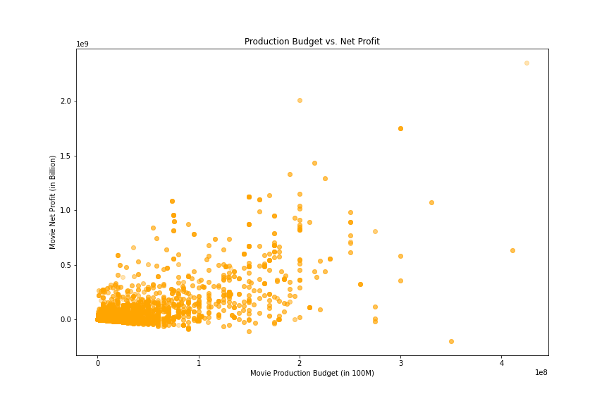
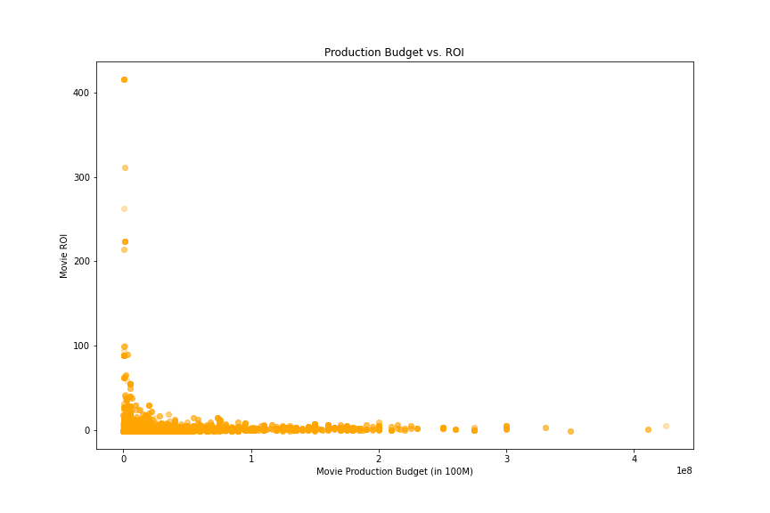
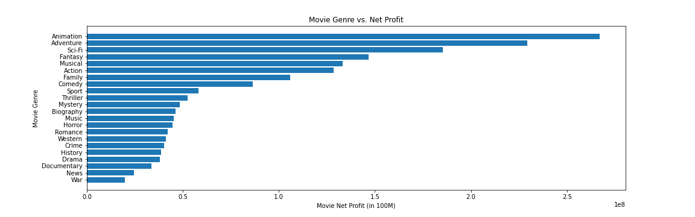
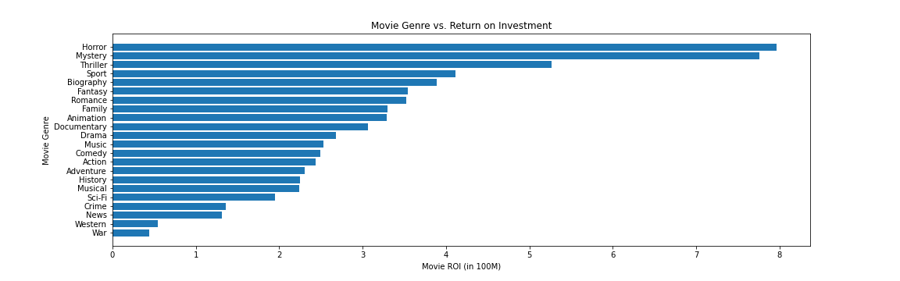

# Microsoft Movie Analysis

**Authors**: Mengwen Tu

## Overview

This project provides Microsoft some suggestions on movie investment, by analysis of the data available on [IMDb](https://www.imdb.com/) and [The Numbers](https://www.the-numbers.com/), two online database that track film information, including movie genres, production crew, budget and box office revenue etc. Descriptive analysis shows that movie production budget and the net profit has a positive correlation, which means the higher budget tend to get a higher profit. The investigation also shows that Animation, adventure, Sci-Fi, Fantasy, Action are the 5 most profitable movie genres. In addition, it seems that director with more experience tend to make a more profitable movie. However, on  the other hand, high profit doesn't mean a high ROI (Return on Investment). If Microsoft would like to get a high ROI, then smaller budget invest on Horror, Mystery, Thriller, Sport, Biography may be a good choice. 

## Business Problem


Microsoft has decided to create a new movie studio, and would like to know what parameters will affect the final success of the movie. Using the available data, we can investigate whether movie production budget, genres, and director experience has influence on the profit and ROI of the movie.


## Data

The data were collected from :
1. [IMDb](https://www.imdb.com/), an online database of films, including film production crew and personal biographies, genres, ratings and so on.
2. [The Numbers](https://www.the-numbers.com/), a film industry data website that tracks box office revenue in a systematic, algorithmic way. 

By combining information of both, we can study the relationship between genres, budget, production crew with the movie profit and ROI. 


## Methods

This project uses descriptive analysis. By analysis and summery of the relationship between the parameters with target variables, we can provide some business insights to the stakeholders. 


## Results

1. The higher budget a movie get invested, the higher profit it is likely to gain. 



2. Many low budget movies tend to have high return on investment.



3. The most 5 profitable movie genres are Animation, Adventure, Science-Fiction, Fantasy and Action



4. The top 5 ROI movie genres are Horror, Mystery, Thriller, Sport and Biography.



5. Directors who had made more than 5 movies gained higer average profit on the movie they made.


## Conclusions

This analysis leads to three recommendations for Microsoft to invest in movie market:
- **Invest higher budget will likely to gain higher profit, while low budget turns to get high ROI** It seems production budget and movie profit has a postive correlation, which means higher budget may bring in higher profit. However, based on the budget-ROI result, it might also be a good idea if Microsoft wants to use a small amount of budget to test the market.
-  **Consider making movies that are more profitable**  The five most profitable movie genres are Animation, Adventure, Science-Fiction, Fantasy and Action. And on the other hand, the top 5 ROI movie genres are Horror, Mystery, Thriller, Sport and Biography.
-  **Consider using more experienced directors** Directors with more than 5 movies tend to earn higher average profit, than directors with less than 5 movies' experience. 


## For More Information

Please review my full analysis in the [Jupyter Notebook](./microsoft_movie_analysis.ipynb) or this [presentation](./Phase1_Project_Presentation.pdf).

For additional info, contact Mengwen Tu at [cherryt0417@gmail.com](mailto:cherryt0417@gmail.com)

## Repository Structure

Describe the structure of your repository and its contents, for example:

```
├── im.db
├── tn.movie_budget.csv
├── images
├── README.md
├── Phase1_Project_Presentation.pdf
└── microsoft_movie_analysis.ipynb
```
